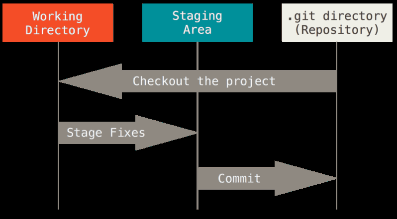

# How to Use GitHub

## Introduction
Program code is developed in a process of creation, modification, testing, revizing, and finalizing. It may undergo many versions before it
can be used for production. Tools are needed to keep track of changes in each version. Git is such an exceptional tool for this purpose, a
version control system (VCS) or source code management. Every time a version of a file is committed or saved in Git, it takes a snapshot of
the file. It allows multiple programmers to work on a project together and synchronizes the version control on each programmer's local
machine. Thus, Git is a fully distributed system with a fast speed.

GitHub is a web-based Git service. It provides all of the distributed version control and source code management functionality of Git and
its own features. GitHub offers both private and free account plans. In the free plan, project repositories are open to the public.
GitHub users can create project repositories, modify and manage them. These projects can almost be anything, such as program code, blogs,
study notes, and so on. GitHub can create URL of these repositories so that they can be shared conveniently. A user can interact with
other users by following, watching, or forking repositories. It becomes a social medium for programmers, just like LinkedIn and Facebook.
GitHub is commonly used to host open-source software projects, such as [Apache Spark project](https://github.com/apache/spark). Everyone
can review, clone, and make contributions to these projects. 

In the following, I will talk about GitHub account creation, Git installation, and project repository creation. After learning these,
readers will be able to use Git and GitHub to manage repositories. The examples given below are for Windows environment.

## GitHub Account
Go to <https://github.com/join> to create an account using your email and select a user name. The public account is free. The private
account is $7/month. You can choose which repositories to be public from your private account.

## Git Installation
Go to <https://git-scm.com/download/win> to download Git. An alternative way to get Git is to installation
GitHub for Windows. The installer includes a command line version of Git and the GUI. The download is at <http://windows.github.com>.

## First-Time Git Setup
After download and installation, Git looks for the `.config` file in home directory (C:\Users\username). A system-level config file is in 
C:\ProgramData\Git\config.

The first thing is to set the user name and email address that you used for GitHub account. This is important because this information is
used for every Git commit. This is an one-time setting. You don't have to execute this step again. In your Git shell window, execute the
following commands.

```sh
$ git config --global user.name "myGitHub"
$ git config --global user.email myEmail@example.com
```
## The Three States of Git
Git has three main states that your files can reside in: committed, modified, and staged. Committed means that the data is safely stored
in your local database. Modified means that you have changed the file but have not committed it to your database yet. Staged
means that you have marked a modified file in its current version to go into your next commit snapshot. This leads us to the three main
sections of a Git project: the Git directory, the working directory, and the staging area.

The basic Git workflow goes something like this:
1. You modify files in your working directory.
2. You stage the files, adding snapshots of them to your staging area.
3. You do a commit, which takes the files as they are in the staging area and stores that snapshot permanently to your Git directory.

This workflow can be illustrated by the following figure (adopted from **Pro Git**, 2nd edition, by *Scott Chacon* and *Ben Straub*)


## Project Repository Creation
A repository is a file directory that contains all your project files, including, but not limited to, `code`, `documents`, `license`, `readme`,
`.gitignore`, `xml`, and `yml`.  You can put anything you want for a project into the repository. All changes and versions are recorded by Git
in the repository.

To work on the project repository, you have to have it on your local machine. There are 2 ways to create a lcoal repository.

* Copy or clone from an existing repository at GitHub website to your local machine. This repository can either under your
own GitHub account or others. First you need to change the working directory to where you want the repository to rest using 'cd' command.
After cloning the repository, you will find a `reposName` folder under `myDir`, which contains all files in `reposName` at GitHub website.
You can use `git remote` to check the default name, `origin`, Git gives to the server you cloned from. You can also use `git remote -v` to
confirm the URLs that Git has stored for the shortname to be used when reading and writing to that remote.

```sh
$ cd myDir
$ git clone https://github.com/userName/reposName
Cloning into 'reposName'...
remote: Reusing existing pack: 1857, done.
remote: Total 1857 (delta 0), reused 0 (delta 0)
Receiving objects: 100% (1857/1857), 374.35 KiB | 268.00 KiB/s, done.
Resolving deltas: 100% (772/772), done.
Checking connectivity... done.
$ cd reposName
$ git remote
origin
$ git remote -v
origin https://github.com/userName/reposName (fetch)
origin https://github.com/userName/reposName (push)
```

* Create a repository directly at your local machine. If you have a folder `reposFolder`(empty folder is fine) and want to take this folder
as a repository, you can go to `reposFolder` and type in `git init`. A folder `.git` will be created under `reposFolder` and a repository
will be initiated in `reposFolder`.
```sh
$ cd reposFolder
$ git init
```

## Tracking and Staging Changes in the Repository
Once you have a repository on your local machine, you can add new folders or files. You can make modifications in existing files. To track
a new file added or changes in a file, you can run this:
```sh
$ git add newFile
$ git add fileName
```
Now the new file and the file changed are tracked and staged to be committed. You can run `git status` to check.
```sh
$ git status
```
If you want to track a lot of files or folders, you can use the wild card `.`.
```sh
$ git add .
```

## Committing Your Changes
the commit records the snapshot you set up in your staging area. Anything you didn’t stage is still sitting there modified; you can do another
commit to add it to your history. Every time you perform a commit, you’re recording a snapshot of your project The simplest way to commit
is to type:
```sh
$ git commit -m 'your commit message'
```
The commit message cannot be skipped. It usually reflect what have changed in your file, such as 'add new codes'.

## Pushing to Your GitHub Account
When you have your project at a point that you want to share, you have to push it upstream. The command for this is simple: `git push
[remote-name][branch-name]`. If you want to push your master branch to the repository you cloned, just simply type:
```sh
$ git push -u origin master
```
`-u` stands for upstream. If you include `-u`, you don't have to type in full URL of the repository when you fetch or pull files from
that repository. `origin` is the default remote server name assigned by `Git` when you clone the repository to your local machine.

If you want to push your locally created repository, you can go to `GitHub` website and create an empty repository and copy its URL. Then do:
``` sh
$ git remote add myRepos https://github.com/username/emptyRepos.git
$ git remote show myRepos
$ git push -u myRepos master
```

By now, you have learned the basics of Git and GitHub. You are able to create your repositories, track changes, and upload your updated
repositories to GitHub where you can share with GitHub community. Enjoy it and be productive!


## Markdown
Markdown is a way to format the display of plan text on web by using some special characters.
[Markdown Cheatsheet](https://github.com/adam-p/markdown-here/wiki/Markdown-Here-Cheatsheet)
[GitHub Markdown supports syntax highlighting for a large number of [languages](http://tinker.kotaweaver.com/blog/?p=152)


